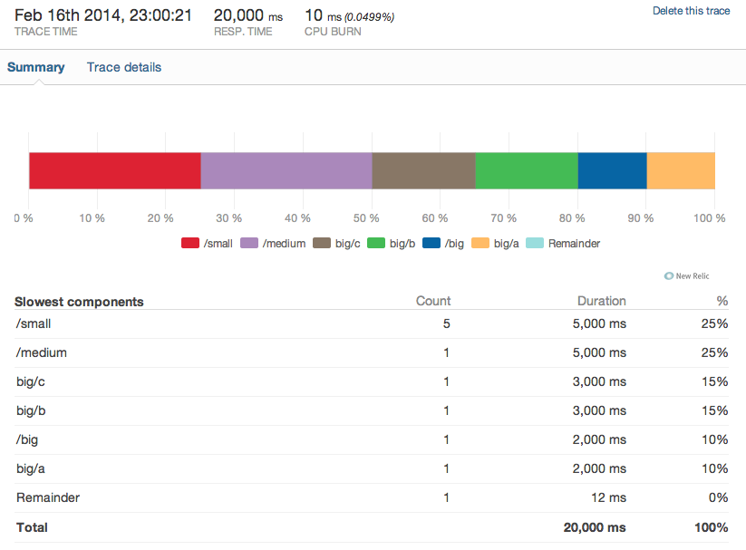

# Resque Instrumentation

This app demonstrates New Relic instrumentation in a Resque job. See the [SlowWorker](https://github.com/benmanns/resque-instrumentation/blob/master/app/workers/slow_worker.rb) class for the example. It generates a trace report that looks like this:

